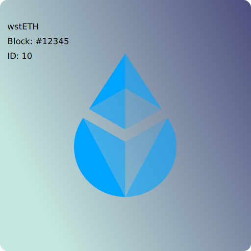

# on-chain-NFT

 - On-chain NFT, inspired by Uniswap V3 NFT.
   - NFT's Image is saved on-chain in SVG format.
 - Converting FT to NFT.
   - Depositing some FT mints a NFT. Burning a NFT returns the deposited FT.
   - Add a collectible element to FT. More UMAMI flavor.
 - NFT for everyone.
   -  Any user can mint a NFT in turn depositing a certain amount of ERC20 token.

### Concept
Lido is a decentralized infrastructure for issuing stETH tokens that you can use while staking ETH.

 - Encourage the use of stETH and wstETH
 - Depositing some FT (such as wstETH) mints a NFT, which automatically generates unique image in SVG format.
 - NFT represents a liquidity in stETH pool, or a owner of FT.
 - NFT is transferable.

Sample Image

[Lido Finance](https://lido.fi)

[Lido Doc](https://docs.lido.fi/)

[Lido Github](https://github.com/lidofinance/lido-dao)

## Setup
To install dependencies,run  
`yarn`

## Compile

`yarn build`

## Test

`yarn test`

Also,This generates a image in SVG format in `images` folder